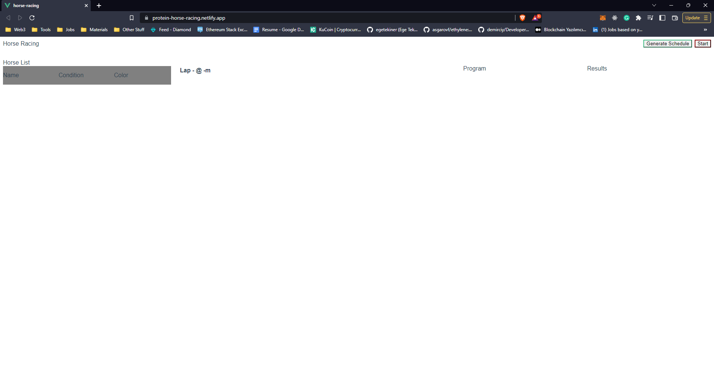
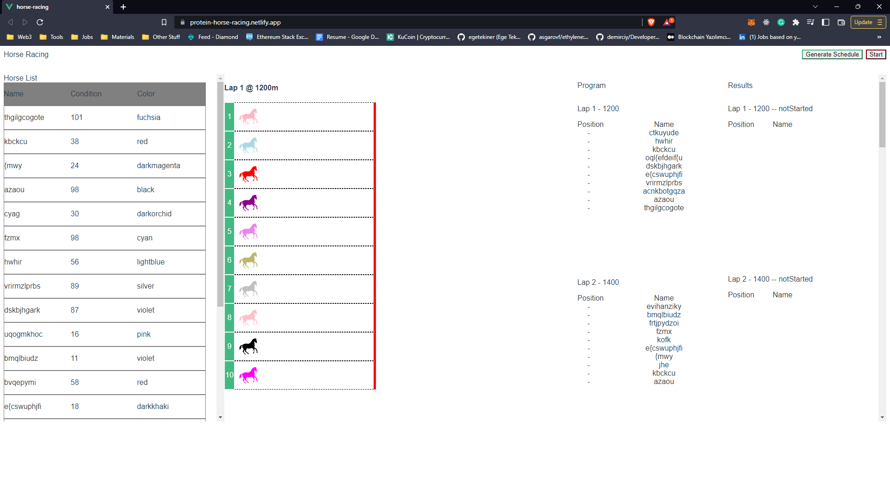

# Horse Racing
> Real-time racing of horses running in different lanes on a straight route.
> Live demo [_here_](https://protein-horse-racing.netlify.app/). <!-- If you have the project hosted somewhere, include the link here. -->

## Table of Contents
* [General Info](#general-information)
* [Technologies Used](#technologies-used)
* [Features](#features)
* [Screenshots](#screenshots)
* [Setup](#setup)
* [Contact](#contact)


## General Information
- Real-time racing of horses running in different lanes on a straight route.During the run, the speeds are instantaneously within a certain range.
changes randomly. In this way, who will win is always determined by the luck factor. Racing is manual via a button
can be started at any time. The race that has started cannot end before the last horse crosses the finish line. last horse
After crossing the finish line and the race is over, the results are shown in a list with lane numbers.


## Technologies Used
- Vue.js - version 2.6.11
- Vue Router - version 3.5.1
- Vuex - version 3.6.2


## Features
List the ready features here:
- Random horse information generation
- Random horse speed generation
- Random horse color generation
- Random horse condition generation


## Screenshots
Opening Scene



After use GenerateSchedule Button


<!-- If you have screenshots you'd like to share, include them here. -->


## Setup


Install the dependencies and devDependencies and start the server.

```sh
cd Protein-Vue.js-Bootcamp-Bitirme-Projesi
yarn install
yarn run serve
```
## Contact
Created by [@halfgork](https://www.linkedin.com/in/gorkemsakalak/) - feel free to contact me!
